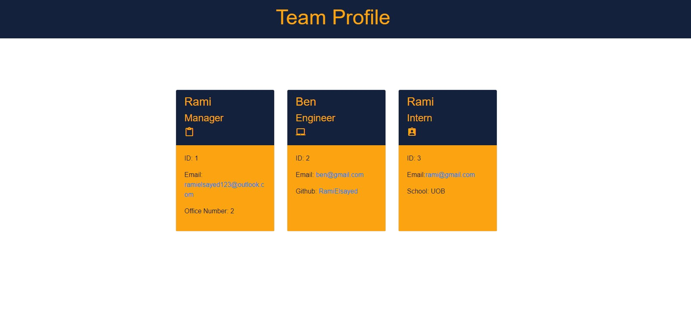

# team-profile-generator

## Description

- This application was created to generate a team profile based on user input using the Inquirer module from Node.js and displaying the information on a newly created html page with a style sheet. 
- This project demonstrates use of OOP and TDD using Jest. 
- In the project I covered as many testing cases as possible, also built html in chunks for future maintainance.
- This project also built using JQuery, bootstrap and google fonts to build HTML page.
- Files organised in a good structured way for easy access.

## Table of Contents

- [Installation](#installation)
- [Usage](#usage)
- [License](#license)
- [Contributing](#contributing)
- [Tests](#tests)
- [Questions](#questions)

## Installation

The user should clone the repository from GitHub and download Node. This application also requires a file system and inquirer module. If testing is required, you will need jest to run tests.

## Usage

Use inquirer from your command line to answer questions about your project. 
[demonstation-video](https://drive.google.com/file/d/1rNCWjh1PhN2mR4nkPqHRRSzs1xg8TvNT/view)

## License 

The project is un MIT license

## Contributing

Contributors should read the installation section.

## Tests

Run `npm test` to run Jest for tests on constructors.

## Questions 

If you have any questions about this projects, please contact me directly at ramielsayed123@outlook.com. You can view more projects of mine at https://github.com/RamiElsayed